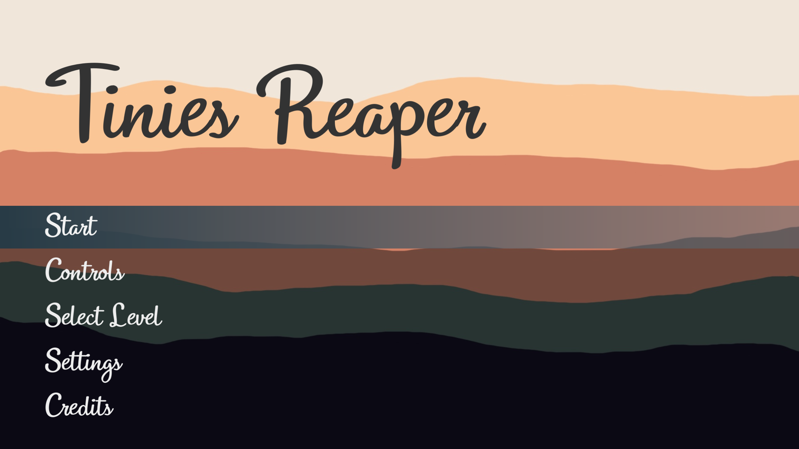
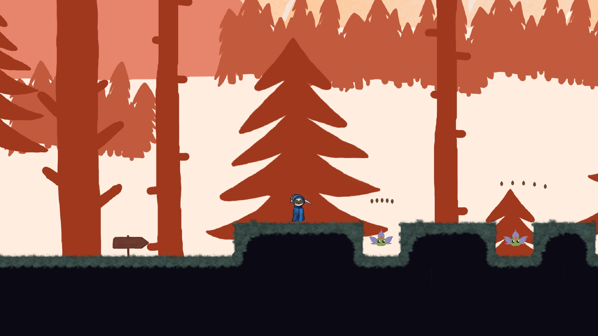
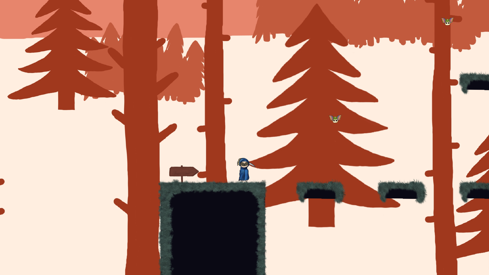
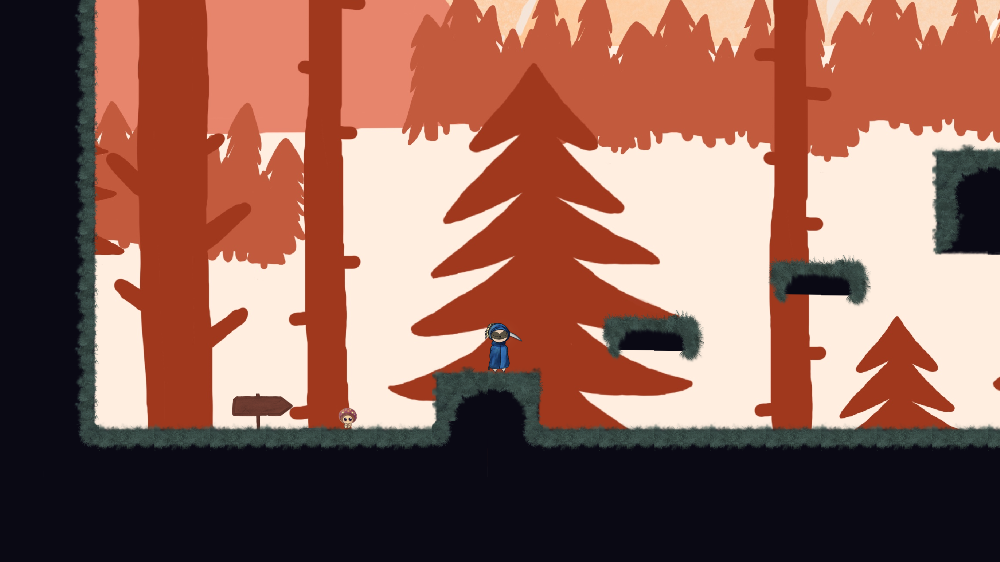

# Ludum-Dare-56
A Godot game which was developed in the [56th Ludum Dare](https://ldjam.com/events/ludum-dare/56) (05.10.2024 - 08.10.2024)

**Theme:** Tiny Creatures

In the enchanting world of Tinies Reaper, step into the role of a gentle Reaper tasked with gathering the whimsical little creatures that inhabit vibrant landscapes. Armed with a beautifully crafted scythe, your mission is to collect their ethereal essences, preserving the delicate balance of magic in this fantastical realm.

Will you navigate the enchanting challenges ahead and become the true guardian of harmony in Tinies Reaper? The essence of the realm awaits your touch!

**Instructions:**
+ A and D for Movement
+ W / Space for Jump
+ Arrow Left, Right, Up and Down for attack
+ Y / Z Zoom Out
+ X Zoom In
+ ESC to return to Main Menu

### [Vie on itch.io](https://kyunru.itch.io/tinies-reaper)

 
 